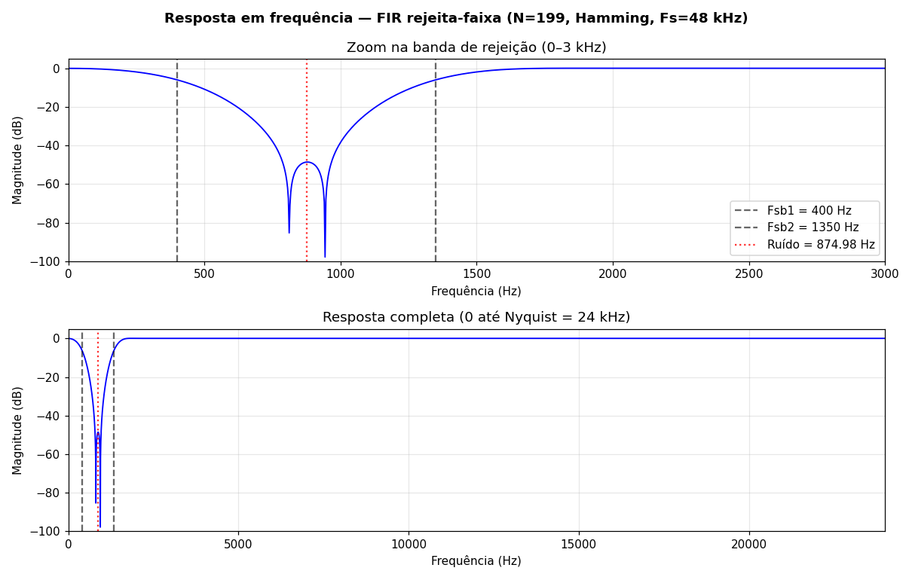
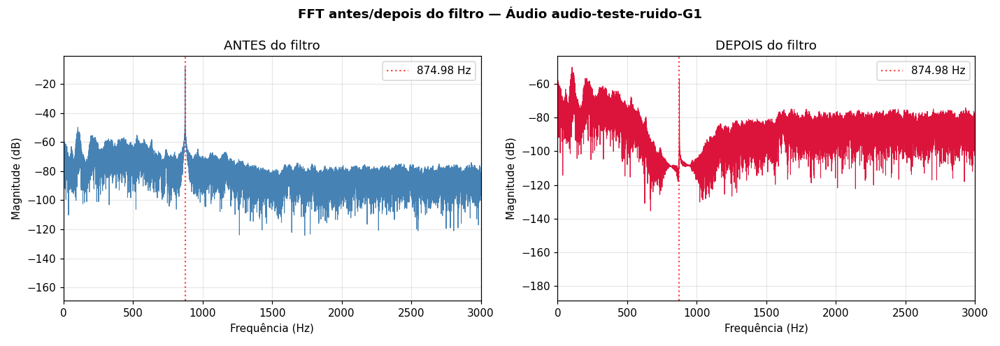
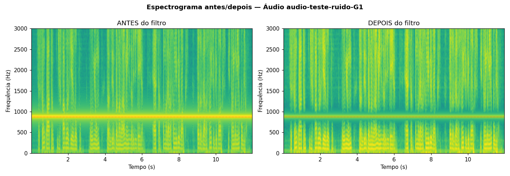
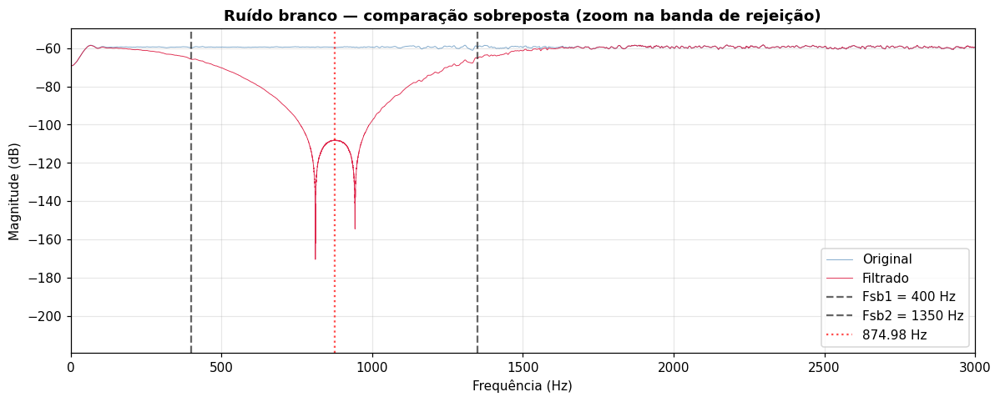

# Filtro Rejeita-Faixa FIR — DSP II

Projeto de filtro digital FIR rejeita-faixa para supressão de ruído tonal em 874,98 Hz, implementado em Python (simulação) e C (tempo real no STM32F4 Discovery + Wolfson Pi Audio).

---

## 📁 Estrutura do Repositório

```
DSP_II_Filtros/
├── src/                      # Código-fonte
│   ├── coeffs_FIR.h         # Header CMSIS-DSP (embarcar no STM32)
│   ├── coeffs_FIR.csv       # Coeficientes em formato pyfda
│   ├── main_comentado.c     # Código embarcado com comentários explicativos
│   ├── gerar_coeficientes.py    # Script Python: gera .csv e .h
│   └── rodar_pipeline.py    # Script Python: aplica filtro e gera gráficos
├── docs/
│   └── pipeline_rejeita_faixa.ipynb  # Notebook completo da validação
├── audio/                   # Áudios de entrada/saída (48 kHz)
│   ├── audio_G1_original_48k.wav
│   ├── audio_G1_filtrado_48k.wav
│   ├── ruido_branco_original_48k.wav
│   └── ruido_branco_filtrado_48k.wav
└── graficos/                # FFT, espectrogramas, resposta em frequência
    ├── 01_resposta_em_frequencia_FIR.png
    ├── fft_audio_G1.png
    ├── spec_audio_G1.png
    └── ...
```

---

## 🎯 Especificações do Filtro

| Parâmetro | Valor |
|-----------|-------|
| **Tipo** | FIR rejeita-faixa (bandstop) |
| **Método** | Janelamento (janela de Hamming) |
| **Ordem (N)** | 199 (limite do kit: N < 200) |
| **Frequência central** | 874,98 Hz (ruído dominante identificado) |
| **Banda de rejeição** | 400 Hz – 1350 Hz (~950 Hz de largura) |
| **Taxa de amostragem (Fs)** | 48 kHz (codec Wolfson WM5102) |
| **Atenuação** | **-48,6 dB** em 874,98 Hz |
| **Atraso de grupo** | 99 amostras (2,06 ms @ 48 kHz) |

### Por que a banda é larga?

Pela relação de janelamento:

**Δf_mín = (K × Fs) / N = (3,3 × 48.000) / 199 ≈ 795 Hz**

Com N < 200 (limitação do kit), foi necessário alargar a banda de rejeição para garantir atenuação significativa no centro. Para um notch estreito (Q = 30 → BW ≈ 29 Hz), seria necessário **N > 5400**, inviável no STM32.

---

## 🚀 Como Usar

### 1️⃣ Validação em Python

```bash
# Instalar dependências
pip install numpy scipy matplotlib pandas soundfile librosa

# Gerar coeficientes do FIR e header CMSIS-DSP
python src/gerar_coeficientes.py

# Processar áudios e gerar gráficos
python src/rodar_pipeline.py
```

Ou rode o notebook completo: `docs/pipeline_rejeita_faixa.ipynb`

### 2️⃣ Embarcar no STM32

1. Copie `src/coeffs_FIR.h` para o seu projeto STM32
2. Compile e grave no STM32F4 Discovery
3. Conecte a saída do PC na **LINE-IN** do Wolfson Pi Audio
4. Toque `audio/audio_G1_original_48k.wav` no PC
5. Capture a saída do codec (fone ou line-out)
6. Compare com `audio/audio_G1_filtrado_48k.wav`

**Importante:** O `main_comentado.c` contém explicações detalhadas sobre:
- Buffers DMA ping-pong
- Desintercalação stereo (LEFT filtrado, RIGHT pass-through)
- Inicialização CMSIS-DSP
- State buffers do FIR

---

## 📊 Resultados

### Resposta em Frequência


### FFT — Áudio G1 (antes/depois)


**Observação:** O pico em 874,98 Hz desaparece completamente após a filtragem.

### Espectrograma — Áudio G1


**Observação:** A linha horizontal amarela do ruído tonal (875 Hz) é totalmente eliminada, preservando as componentes da voz.

### Validação com Ruído Branco


O ruído branco "desenha" a resposta em frequência do filtro, confirmando o notch em 875 Hz.

---

## 🛠️ Tecnologias

- **Python:** `scipy.signal.firwin` (projeto), `librosa` (processamento de áudio), `matplotlib` (plots)
- **C (embarcado):** CMSIS-DSP (ARM), HAL STM32, codec Wolfson WM5102
- **Hardware:** STM32F4 Discovery, Wolfson Pi Audio Shield
- **Ferramentas:** pyfda (validação), OcenAudio (inspeção), Jupyter Notebook

---

## 📝 Limitações Conhecidas

1. **Banda de rejeição larga (950 Hz):** Inevitável com N = 199. Componentes da voz entre 400–1350 Hz sofrem atenuação parcial.
2. **Fase linear:** Filtro FIR garante fase linear (preserva forma de onda), ao custo de ordem elevada para bandas estreitas.
3. **Alternativa IIR:** Um filtro Notch IIR de 2ª ordem atinge BW ≈ 29 Hz (Q = 30) com apenas 3 coeficientes, mas introduz fase não-linear.

---

## 👤 Autor

**Mateus F. Tatim**  
Disciplina: DSP II  
Projeto: Filtro Rejeita-Faixa FIR

---

## 📄 Licença

Este projeto é de uso acadêmico. Sinta-se livre para estudar, modificar e compartilhar com fins educacionais.
